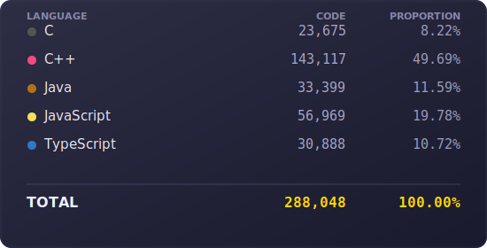

## Software Developer 

Systems    -> c/c++ windows, java

Security   -> Ghidra, IDA (someone give me pro), Cheat Engine, Win32 API

Full Stack -> TypeScript, ReactJS, Springboot, (No)SQL Security Practices

## Double major in Computer Science and Economics Student @ University of Wisconsin-Madison 

---

---

I've been coding since I was 13 (2019) with Java and self-studied for 2 years (though my first program ever made was back in 2015 p.s. check out my first minecraft mod somewhere in my repos!). I took AP Computer Science my Sophomore year and got a 5 on the AP Exam. 
This was the first time I had received formal instruction. 

### University of Wisconsin-Madison
Now I work at a different startup, AI & Prototyping Engineer, contracting for a telecom industry client, am still working on coding projects, and currently exploring different avenues.     

* 🌍  I'm based in Illinois (Chicago) / Wisconsin (Madison)
* ✉️  You can contact me at [justin.angara@gmail.com](mailto:justin.angara@gmail.com) or [jangara@wisc.edu](mailto:jangara@wisc.edu) 
---
High School
---
I'm a graduate from a coding boot camp, a former AP Computer Science teacher assistant, a code club captain, and an former intern at Comet. 

Some background knowledge: I was a competitor for multiple hackathons, took some classes on front-end/back-end development at UC Berkeley Extension & UCLA Extension, and was a former AVID, Math, and Computer Science tutor. 

### 🔗 Connect with Me
- [LinkedIn – Justin Angara](https://www.linkedin.com/in/JustinAngara)  
- [GitHub – Justin Angara](https://github.com/JustinAngara)  
- [YouTube Channel](https://www.youtube.com/channel/UCtimiRO-DciauBTthTVYChA)  
- [Personal Website](https://justinangara.github.io/personal-website/)  

### 📊 GitHub Stats:

## LOC

